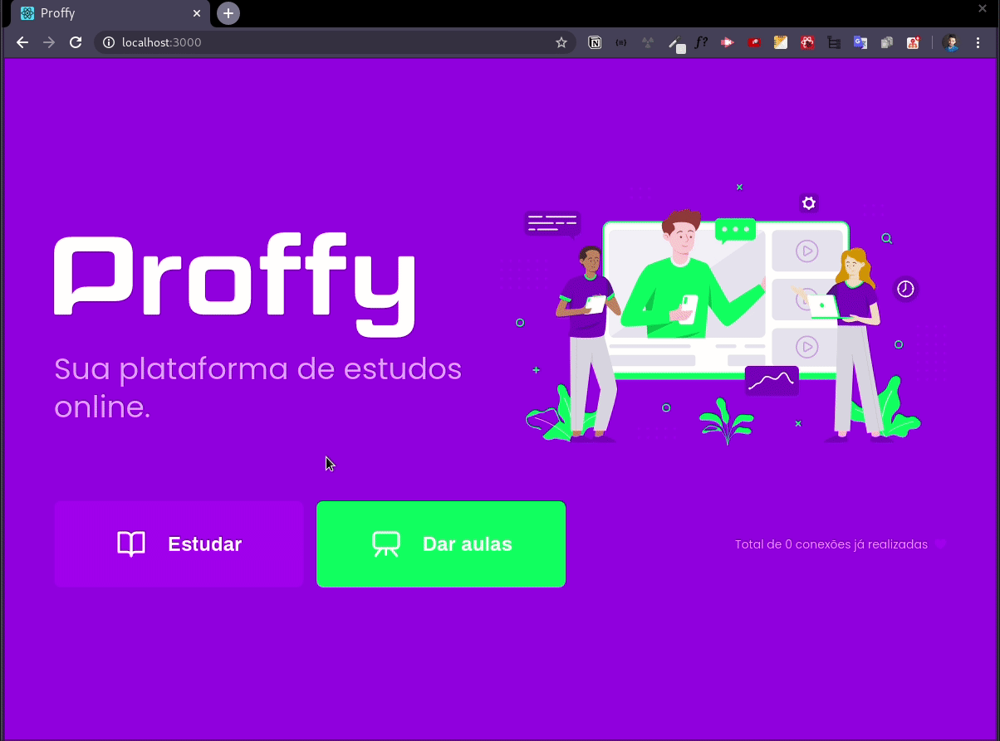

<h1 align="center">
    
</h1>

<h1 align="center">
  Proffy
</h1>

<div align="center">
 "Ao infinito e além 🚀"
</div>

&nbsp;

<h1 align="center">
    
</h1>

## Sobre 🤓

O proffy é uma plataforma onde professores podem anunciar seu trabalho e alunos com sede de aprender podem se conectar a esses professores. Foi uma aplicação desenvolvida em um evento chamado Next Level Week promovido pela Rocketseat e que o intuito deles é te levar para o próximo nível.

## Como posso usar sua aplicação 🔧🆙 ?

### Requisitos:

- NodeJS (v12)
- Yarn

&nbsp;

## Rodando a aplicação

No seu terminal faça um clone do projeto

```bash
git clone https://github.com/brunoJSX/proffy
```

### Preparando API

```bash
cd server
yarn
yarn knex:migrate
yarn start
```

### Subindo aplicação web

```bash
cd web
yarn
yarn start
```

E pronto!!!
&nbsp;

<h2 align="center">
 Gostou? 🥳🚀
</h2>

<div align="center">
 Se gostou avalie com uma linda 🌟, dessa forma você irá me incentivar a publicar mais projetos cada vez melhores.
</div>
